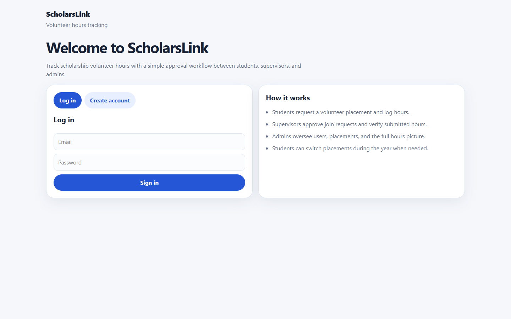
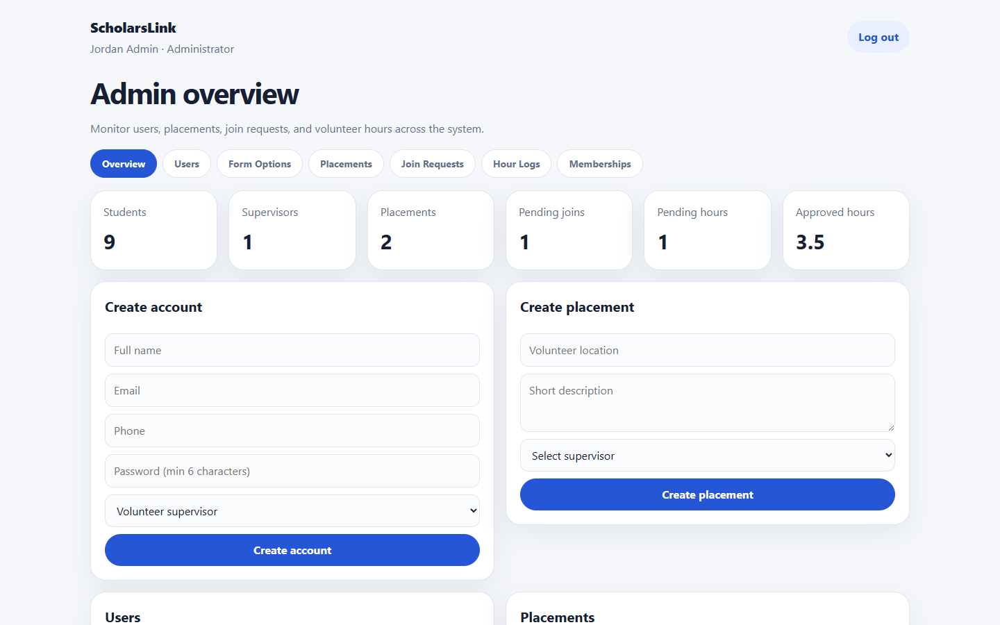
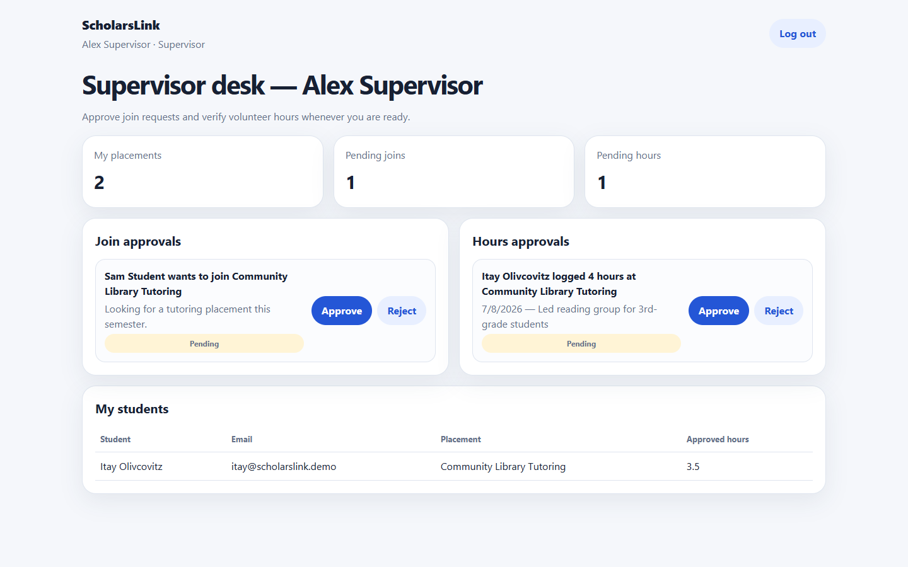
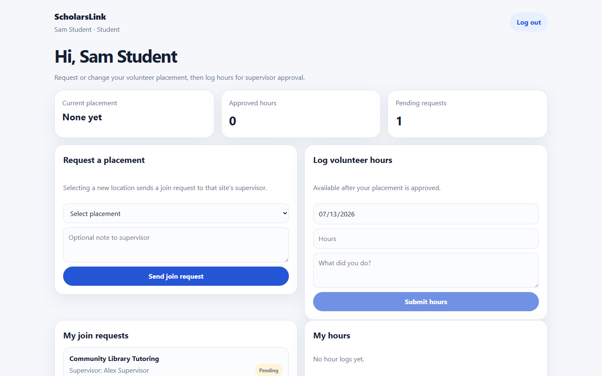
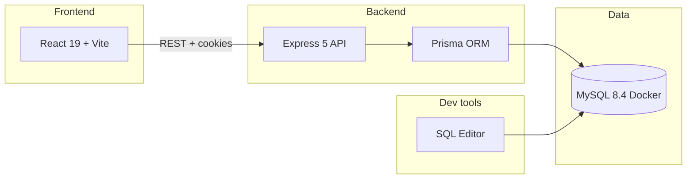

# ScholarsLink

**Full-stack volunteer-hours tracker for scholarship programs** — students log hours, supervisors approve them, and admins oversee the whole pipeline.

[](https://github.com/itayoliv/ScholarsLink/actions/workflows/ci.yml)


<p align="center">
  
</p>

## Why this project

Scholarship programs often need a reliable way to prove volunteer hours. ScholarsLink turns that into a clear approval workflow:

| Role | What they do |
|------|----------------|
| **Student** | Complete registration, request a placement, log hours |
| **Supervisor** | Approve join requests and verify submitted hours |
| **Admin** | Manage users, placements, and system-wide totals |

## Features

- **Role-based dashboards** with route guards for Student, Supervisor, and Admin
- **Cookie sessions** (HTTP-only) with AES-encrypted password storage in MySQL
- **Approval workflows** for placement join requests and hour logs (`PENDING` / `APPROVED` / `REJECTED`)
- **Student registration** with configurable form options and document uploads (BLOB storage)
- **Dynamic admin CRUD** driven by schema introspection (`information_schema`) — generic entity pages without hardcoding every table UI
- **Dockerized MySQL** with Prisma migrations for reproducible local setup
- **Companion SQL editor** for ad-hoc queries during development (localhost only)

## Screenshots

### Admin overview
Tracks users, placements, pending joins, and approved hours across the system.



### Supervisor desk
Approve join requests and verify hour logs from one screen.



### Student dashboard
Request a volunteer placement and submit hours for review.



## Architecture



| Component | Stack | Default port |
|-----------|--------|--------------|
| Frontend | React 19, Vite 8, React Router 7 | `5173` |
| Backend API | Node.js, Express 5, Prisma 6 | `4000` |
| Database | MySQL 8.4 (Docker Compose) | `3306` |
| SQL editor | CodeMirror UI + Express | `5174` / `4100` |

## Project structure

```text
ScholarsLink/
├── backend/           # Express API + Prisma schema & migrations
├── frontend/          # React SPA (role dashboards + admin CRUD)
├── sql-editor/        # Optional localhost SQL tool
├── docker/            # MySQL init scripts
├── docs/screenshots/  # README screenshots
└── docker-compose.yml # MySQL service
```

## Quick start

### Windows (one click)

After cloning, double-click [`start.bat`](start.bat). It copies `.env` files if missing, installs dependencies, starts MySQL when Docker is available, migrates/seeds, then opens the backend and frontend.

If Docker Desktop is not running, the script warns and continues so the **frontend** at http://localhost:5173 still starts. Login/API need MySQL — fix Docker and run `start.bat` again when ready.

### Prerequisites

- Node.js 20+
- Docker Desktop (for MySQL — optional for viewing the UI only)

### 1. Clone and configure

```bash
git clone https://github.com/itayoliv/ScholarsLink.git
cd ScholarsLink

copy backend\.env.example backend\.env
copy frontend\.env.example frontend\.env
```

Edit `backend\.env` and set a secret `PASSWORD_AES_KEY` (required — the API will not start without it).

### 2. Install dependencies

```bash
npm install --prefix backend
npm install --prefix frontend
```

### 3. Start MySQL and run migrations

```bash
npm run db:up
npm run prisma:migrate -- --name init
npm run db:seed --prefix backend
```

### 4. Run the app

```bash
npm run dev:backend
npm run dev:frontend
```

Open **http://localhost:5173** — API listens on **http://localhost:4000**.

## Core workflow

1. A **student** creates an account, completes registration (and optional document uploads), then requests a volunteer placement.
2. A **supervisor** approves the join request; the student becomes an active member of that placement.
3. The student **logs hours**; the supervisor approves or rejects each entry.
4. An **admin** monitors totals, manages users/placements, and uses schema-driven CRUD for day-to-day data fixes.

## API overview

| Area | Examples |
|------|----------|
| Auth | `POST /auth/register`, `POST /auth/login`, `POST /auth/logout`, `GET /auth/me` |
| Placements | `GET/POST /placements` |
| Join requests | `GET/POST /join-requests`, `PATCH /join-requests/:id` |
| Hour logs | `GET/POST /hour-logs`, `PATCH /hour-logs/:id` |
| Student registration | `GET/POST /student/registration`, file uploads |
| Admin | `/admin/summary`, `/admin/schema`, entity CRUD |

## Tech highlights (resume talking points)

- Built a **multi-role React SPA** with protected routes and session auth
- Designed a **MySQL schema** covering users, placements, memberships, join requests, and hour logs
- Used **Prisma migrations** for schema evolution and a reproducible Docker MySQL environment
- Implemented **supervisor approval queues** for both placements and hours
- Added **schema-introspection admin CRUD** so new tables/columns can surface in the UI with less custom code

## Optional: SQL editor

A standalone query tool lives in [`sql-editor/`](sql-editor/). Useful for debugging.

```bash
npm run sql-editor:server
npm run sql-editor:client
```

See [sql-editor/README.md](sql-editor/README.md).

## License

MIT — see [LICENSE](LICENSE).
